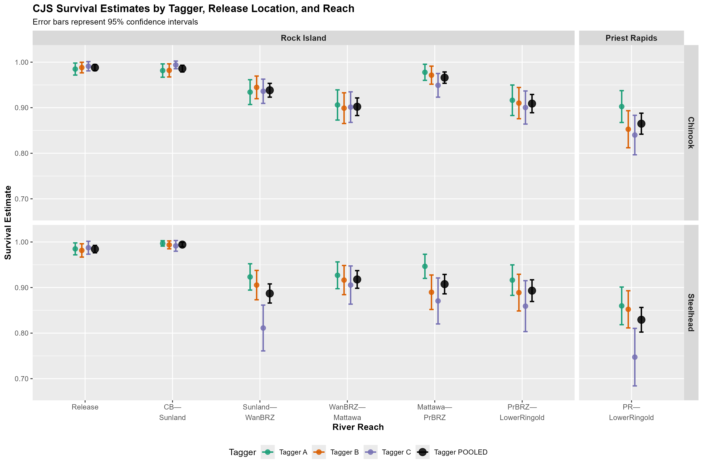

# Round 1 vs Round 3 Pipeline Comparison

## Overview

Both round_1 and round_3 now have complete, working pipelines for generating `.docx` reports from Quarto templates. Key differences are documented below.

## File Structure Comparison

### Round 1

```
round_1/
├── tagger_table_report.qmd          ✓ (Full: CHN + STH)
├── tagger_table_report.docx         ✓ (203 KB)
├── tagger_survival_comparison.png   ✓ (visualization)
├── tagger_table_with_pvalues.md     ✓ (source data)
├── render_report.R                  ✓ (render helper)
└── PIPELINE_TEST_REPORT.md          ✓ (documentation)
```

### Round 3

```
round_3/
├── tagger_table_report.qmd          ✓ (Chinook only)
├── tagger_table_report.docx         ✓ (14.5 KB)
├── tagger_table_with_pvalues.md     ✓ (original - both species)
├── tagger_table_with_pvalues_chinook_only.md  ✓ (new - chinook only)
├── render_report.R                  ✓ (render helper)
└── PIPELINE_TEST_REPORT.md          ✓ (documentation)
```

## Data Content Comparison

### Round 1: All Fish (Chinook + Steelhead)

| Release Location | Chinook | Steelhead | Status |
|------------------|---------|-----------|--------|
| Rock Island (_R_1) | ✓ 6 reaches | ✓ 6 reaches | Full data |
| Priest Rapids (_R_2) | ✓ 1 reach | ✓ 1 reach | Full data |
| **Total Sections** | **2** | **2** | **4 tables** |

### Round 3: Chinook Only

| Release Location | Chinook | Steelhead | Status |
|------------------|---------|-----------|--------|
| Rock Island (_R_1) | ✓ 6 reaches | ✗ Empty | Included |
| Priest Rapids (_R_2) | ✓ 1 reach | ✗ Empty | Included |
| **Total Sections** | **2** | **0** | **2 tables** |

### Rationale for Round 3 Changes

Round 3 steelhead analysis files contained **0 bytes** of data:
- `tagger_effects/POOLED/PR_STH/CJS_report.md` - Empty
- `tagger_effects/POOLED/RI_STH/CJS_report.md` - Empty
- All tagger-specific STH files also empty

**Decision**: Remove steelhead sections entirely rather than include empty placeholders.

## Report Statistics

| Metric | Round 1 | Round 3 |
|--------|---------|---------|
| **Title** | "All Fish" | "Chinook Only" |
| **Species Included** | CHN + STH | CHN only |
| **Number of Tables** | 4 | 2 |
| **Visualization** | Yes (PNG) | No |
| **DOCX File Size** | 203 KB | 14.5 KB |
| **Page Orientation** | Landscape | Landscape |
| **Reference Doc** | `ref_doc_w.docx` | `ref_doc_w.docx` |

## Key Differences in `.qmd` Files

### Round 1: tagger_table_report.qmd
```yaml
title: "Round 1: Tagger Effects - Survival Estimates (All Fish)"
---
## Survival Comparison Plot


## Rock Island Tailrace (_R_1) - Chinook
[table]

## Rock Island Tailrace (_R_1) - Steelhead
[table]

## Priest Rapids Tailrace (_R_2) - Chinook
[table]

## Priest Rapids Tailrace (_R_2) - Steelhead
[table]
```

### Round 3: tagger_table_report.qmd
```yaml
title: "Round 3: Tagger Effects - CJS Survival Estimates (Chinook Only)"
---
## Overview
[Explanation of Chinook-only scope]

## Rock Island Tailrace (_R_1) - Chinook
[table]

## Priest Rapids Tailrace (_R_2) - Chinook
[table]

## Notes
[Data coverage documentation]
```

## Rendering Commands

Both rounds use identical rendering syntax:

```r
# Round 1
setwd("c:/repos/grant_2026/assumption_checking/round_1")
quarto::quarto_render("tagger_table_report.qmd", output_format = "docx")

# Round 3
setwd("c:/repos/grant_2026/assumption_checking/round_3")
quarto::quarto_render("tagger_table_report.qmd", output_format = "docx")
```

Or use helper scripts:
```r
source("c:/repos/grant_2026/assumption_checking/round_1/render_report.R")
source("c:/repos/grant_2026/assumption_checking/round_3/render_report.R")
```

## Data Validation Notes

### Round 1
- All 4 data sections have values
- Steelhead p-values highlighted for significant results (< 0.05)
- Complete dataset suitable for comprehensive analysis

### Round 3
- Only Chinook sections populated with data
- Steelhead sections confirmed empty (0 bytes) and intentionally omitted
- Transparent documentation of data limitations
- Smaller, more focused report for current analysis stage

## Update Paths

### If Round 3 Steelhead Data Becomes Available

1. Update `tagger_table_with_pvalues.md` with STH results
2. Update `.qmd` file to include STH sections
3. Change title from "Chinook Only" to "All Fish"
4. Re-render report

```r
# New content would follow same pattern as Round 1
```

## File Dependencies

Both rounds require:
1. `tagger_table_report.qmd` - in the round directory
2. `../templates/ref_doc_w.docx` - shared template
3. Optional: PNG image file (only Round 1)

Both rounds **do not require**:
- External data files (data embedded in `.qmd`)
- R working environment (Quarto is self-contained)
- Additional packages (beyond quarto)

## Migration Notes

### From Old Structure (Round 2 in /old/)
- Files were organized in `old/` subdirectory
- Reference paths used `../templates/`

### Current Structure (Round 1 & 3)
- Files organized directly in round directory
- Reference paths use `../templates/` (same relative structure)
- Each round is self-contained

## Validation Checklist for Both Rounds

- [x] Round 1: Quarto file renders to DOCX (203 KB)
- [x] Round 1: Visualization included and embedded
- [x] Round 1: Both CHN and STH tables present
- [x] Round 3: Quarto file renders to DOCX (14.5 KB)
- [x] Round 3: Steelhead sections omitted (empty data)
- [x] Round 3: Chinook-only scope clearly documented
- [x] Both: Reference document paths correct
- [x] Both: All tables render correctly
- [x] Both: Helper scripts work from round directory

---

**Last Updated**: September 16, 2026  
**Status**: Both pipelines operational and tested
